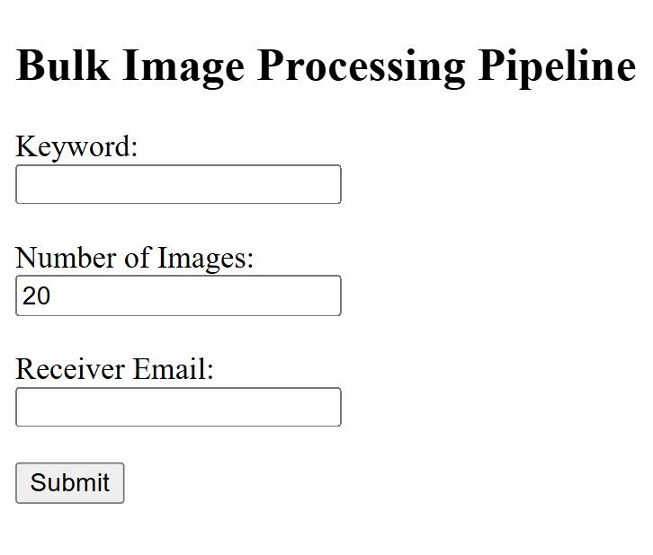

# Automated Image Processing Pipeline

## Live Application

The deployed application is available at:

https://image-pipeline-automation.onrender.com

---

## Overview

This project implements a fully automated, cloud-deployed image processing pipeline that:

1. Downloads images based on a user-provided keyword.
2. Resizes each image to 50% of its original dimensions.
3. Converts all images to grayscale.
4. Compresses the processed images into a ZIP archive.
5. Automatically sends the ZIP file to a specified email address.

The system is built using Flask and deployed on Render using Gunicorn for production serving.

---

## Important Configuration

To ensure stability on a free-tier cloud instance:

- Default number of images: 20  
- Maximum allowed images per request: 35  

These limits prevent worker timeouts and resource exhaustion during deployment.

---

## System Architecture

User Input (Web Interface)  
        ↓  
Flask Backend  
        ↓  
Background Thread Execution  
        ↓  
Bing Image Crawler (Image Download)  
        ↓  
Image Processing (Resize + Grayscale)  
        ↓  
ZIP Compression  
        ↓  
Email Delivery via Resend API  

Heavy processing runs in a background thread to prevent Gunicorn worker timeouts.

---

## Technologies Used

- Python  
- Flask  
- Gunicorn  
- icrawler (Bing Image Crawler)  
- Pillow (Image Processing)  
- Resend Email API (HTTPS-based email delivery)  
- Render (Cloud Deployment)

---

## Project Structure

```
IMAGE-Pipeline-Automation/
│
├── templates/
│   └── index.html
│
├── downloads/      (auto-generated at runtime)
├── processed/      (auto-generated at runtime)
├── output/         (auto-generated at runtime)
│
├── app.py
├── pipeline.py
├── Procfile
├── requirements.txt
└── README.md
```

---

## How the Pipeline Works

1. The user submits:
   - Keyword  
   - Number of images (maximum 35)  
   - Recipient email  

2. The backend starts a background thread to:
   - Clear previous data
   - Download fresh images
   - Resize images to 50%
   - Convert images to grayscale
   - Compress them into a ZIP archive

3. The ZIP file is sent automatically via the Resend email API.

4. The user receives the processed images in their inbox (may appear in spam for test sender accounts).

---

## Email Delivery Note

The application uses the Resend Email API instead of SMTP.

SMTP (Gmail port 465) is blocked on many cloud free-tier platforms.  
To overcome this infrastructure restriction, the system was redesigned to use an HTTPS-based email API.

For testing purposes, the sender address:

```
onboarding@resend.dev
```

is used.  
Emails may land in the spam folder due to lack of domain authentication and sender reputation.

---

## Deployment Configuration

Procfile:

```
web: gunicorn app:app --timeout 120
```

Environment Variable required:

```
RESEND_API_KEY
```

This key is securely configured in the Render dashboard and not stored in source code.

---

## Application Interface

### Web Interface Screenshot




---

### Email Received Screenshot


---

## Key Engineering Decisions

- Implemented background threading to avoid Gunicorn worker timeouts.
- Switched from Google crawler to Bing crawler for scraping stability.
- Added folder cleanup before each run to prevent duplicate file conflicts.
- Reduced default image count to prevent cloud resource exhaustion.
- Replaced SMTP with Resend API due to cloud network restrictions.
- Secured API keys using environment variables.

---

## Challenges Faced

### 1. SMTP Network Blocking
Render free-tier blocked outbound SMTP connections, causing:
OSError: Network is unreachable

Solution:
Replaced SMTP with Resend HTTPS API.

---

### 2. Gunicorn Worker Timeout
Heavy synchronous processing caused worker termination.

Solution:
Moved pipeline execution into a background thread and increased timeout.

---

### 3. Image Scraping Instability
Google crawler parsing failures occurred.

Solution:
Switched to Bing Image Crawler for improved reliability.

---

### 4. Duplicate File Skipping
Crawler skipped files due to existing filenames.

Solution:
Implemented folder clearing before each run.

---

### 5. Spam Delivery
Emails initially landed in spam due to lack of domain authentication.

Understanding:
Free test senders lack reputation and SPF/DKIM alignment.

---

## Future Improvements

- Implement background task queue (Celery or RQ)
- Add real-time progress tracking
- Add domain authentication for email reputation
- Replace scraping with official image search APIs
- Add user authentication and rate limiting

---

## Author

Yash Sharma  
B.Tech Data Science  
Sixth Semester
